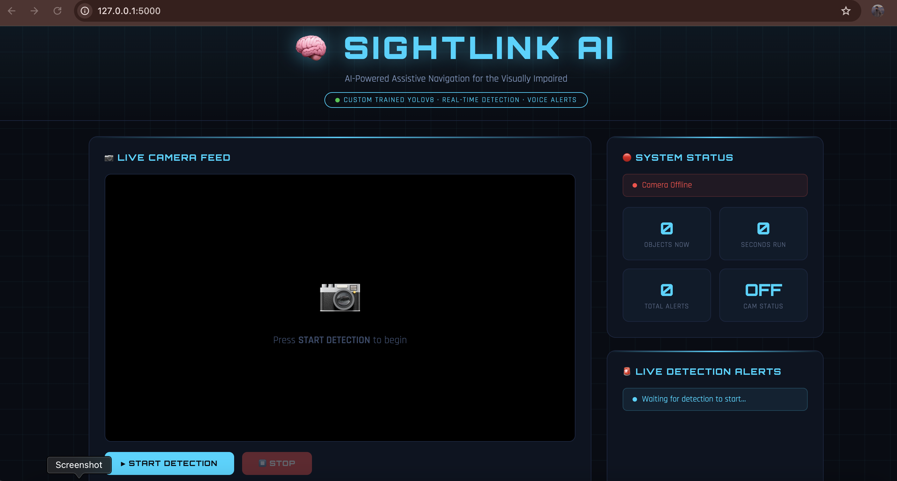
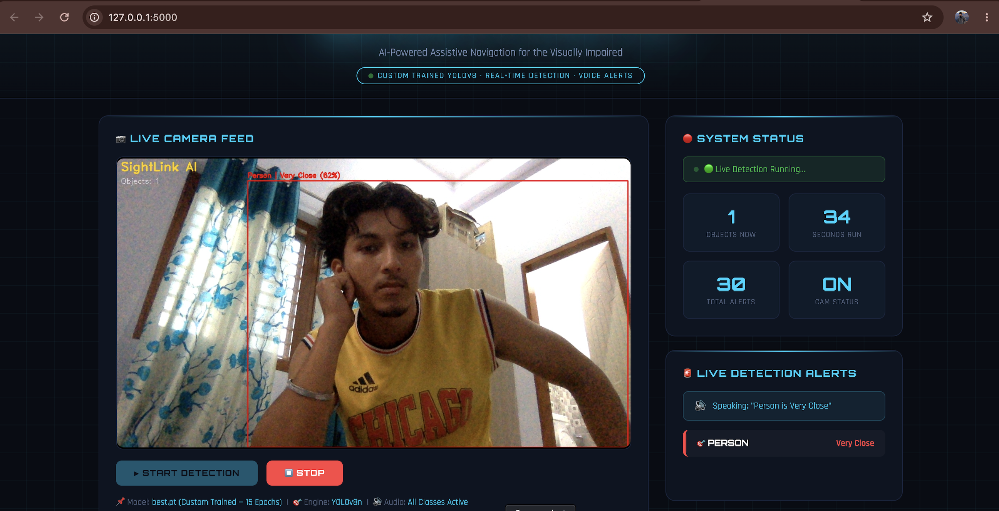
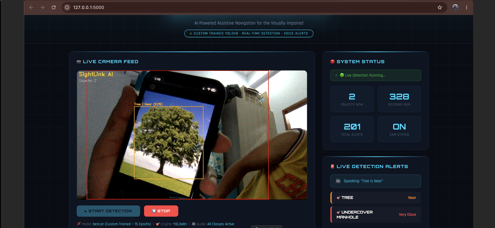
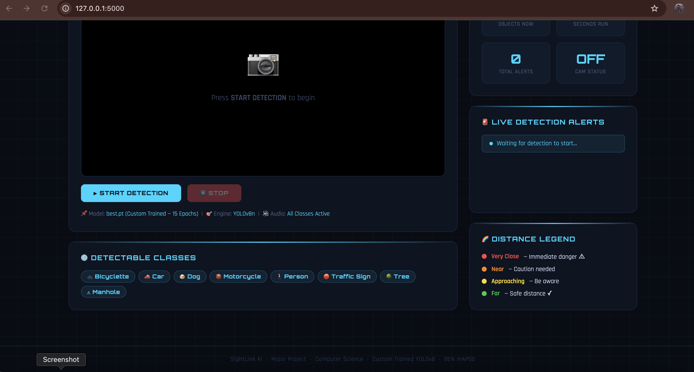

# 🧠 SightLink AI

An AI-powered assistive navigation system designed to help visually impaired individuals navigate safely by detecting obstacles in real time using a custom-trained YOLOv8 model. The system provides distance-aware voice alerts and a live monitoring dashboard for enhanced situational awareness.

---

## 🚀 Features

- Real-time object detection using a custom-trained YOLOv8 model
- Live camera feed processing
- Distance-aware obstacle classification:
  - Far
  - Approaching
  - Near
  - Very Close
- Voice-based obstacle alerts
- Interactive Flask web dashboard
- Real-time detection statistics
- Multi-object detection support
- Custom obstacle dataset training

---

## 🎯 Detectable Objects

The model is trained to detect the following obstacle classes:

- 👤 Person
- 🚗 Car
- 🚲 Bicycle
- 🏍 Motorcycle
- 🐶 Dog
- 🌳 Tree
- 🚦 Traffic Sign
- ⚠️ Undercover Manhole

---

## 🖼️ Project Screenshots

### Home Screen


### Person Detection


### Multi-Object Detection


### Supported Classes & Distance Legend


---

## 🛠️ Tech Stack

### Backend
- Python
- Flask

### Computer Vision & AI
- OpenCV
- YOLOv8 (Ultralytics)

### Frontend
- HTML
- CSS
- JavaScript

### Dataset & Training
- Roboflow
- Custom YOLOv8 Training Pipeline

---

## 📂 Project Structure

```text
SightLink-AI/
│
├── app.py
├── train.py
├── templates/
│   └── index.html
│
├── Obstacle detection.yolov8/
│   ├── data.yaml
│   ├── README.roboflow.txt
│   └── train/
│
├── screenshots/
│
└── .gitignore
```

---

## ⚙️ Installation

Clone the repository:

```bash
git clone https://github.com/SandeepBisht672005/SightLink-AI.git
cd SightLink-AI
```

Install dependencies:

```bash
pip install -r requirements.txt
```

---

## ▶️ Running the Project

Start the Flask server:

```bash
python app.py
```

Open your browser and visit:

```text
http://127.0.0.1:5000
```

---

## 🔮 Future Enhancements

- Mobile application integration
- GPS-based navigation assistance
- Bluetooth earphone voice guidance
- Improved distance estimation algorithms
- Raspberry Pi / Edge-device deployment
- Cloud-based monitoring and analytics

---

## 📌 Note

The trained YOLOv8 weights file (`best.pt`) is not included in this repository due to file size limitations.

---

## 👨‍💻 Author

**Sandeep Bisht**

B.Tech – Computer Science & Engineering

GitHub: https://github.com/SandeepBisht672005
